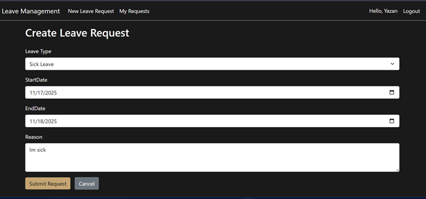
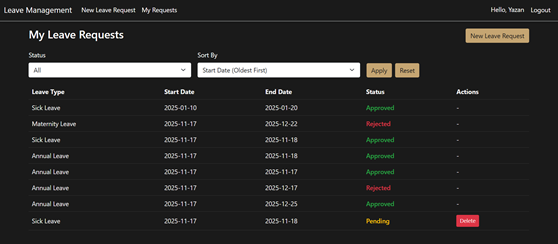
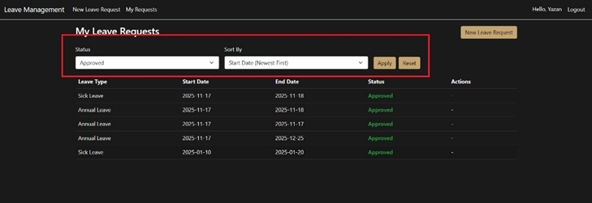
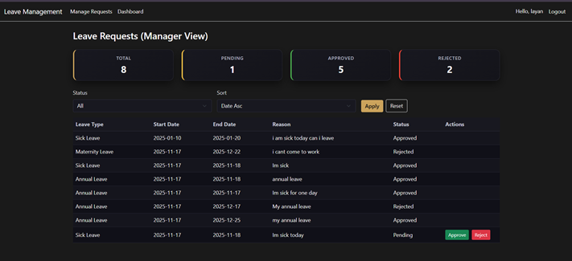
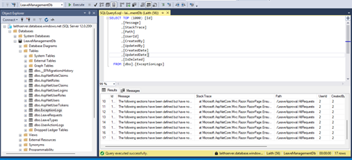
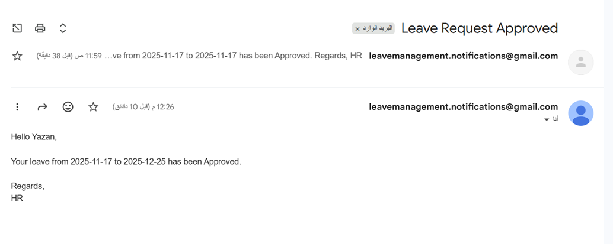

# Employee Leave Management System

 ASP.NET Core MVC Internal application that allows employees to submit leave requests and managers to review, approve, or reject them.  
Built using Clean Architecture principles with EF Core (Code-First) and ASP.NET Core Identity.

---

##  Features

### Employee
- Submit new leave requests
- View all previously submitted requests
- Filter & sort requests by status and date
- Delete leave requests while they are still **Pending**





### Manager
- View all employee leave requests
- Approve or reject pending requests
- Filter and sort by status and date


### System-Wide
- Centralized exception handling middleware

- Role-based authorization (Employee / Manager)
- Custom exception logger
- Email service abstraction (SMTP implementation)
- Clean modular structure: Application, Infrastructure, WebUI


---

##  Tech Stack

- **ASP.NET Core 8 MVC**
- **Entity Framework Core (Code First)**
- **SQL Server / Azure SQL**
- **ASP.NET Core Identity**
- **MediatR for CQRS commands & queries**
- **Bootstrap (UI)**

---


### 1. Clone the repository

```bash
git clone https://github.com/Laith-Alhelo/LeaveManagement.git
cd EmployeeLeaveManagement

### 2. Configure the connection string

Inside LeaveManagement.WebUI/appsettings.json:

"ConnectionStrings": {
  "DefaultConnection": "Server=.;Database=EmployeeLeaveDb;Trusted_Connection=True;TrustServerCertificate=True;"
}

### 3.Apply EF Core migrations

Using the .NET CLI:

dotnet ef database update \
  --project LeaveManagement.Infrastructure \
  --startup-project LeaveManagement.WebUI

### 4.Default Roles & Seed Users

The system seeds default Identity roles and accounts at startup.
Note : You can create your own user after Login using the Manager email and password
Roles & Seed Users
Employee
Email = "laithhelo13@gmail.com"
pass ="Employee@123!"
Manager
Email = "layanuhj1233@gmail.com",
pass ="Manager@123!"


